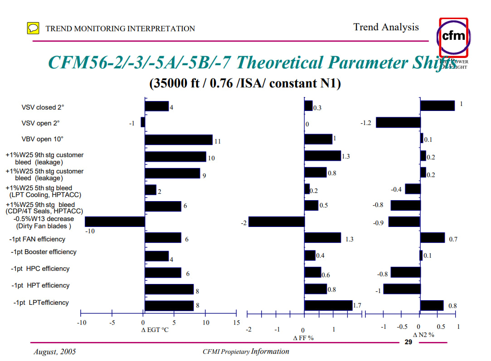

# Engine Condition Assessment (Задание 2)

## Описание задачи:

Предсказание дефектов двигателей в соответствии с правилами, описанными в 6 главе методики оценки состоянии двигателей.

Решение данной задачи будет строиться с использованием языка Python и следующего стека технологий: 

- pandas и numpy для работы с данными
  
- seaborn и matplotlib для визуализации данных
  
На начальном этапе необходимо определить уникальные семейства двигателей в датасете, а также теоретические сведения о значениях параметров, которые свидетельствуют о наличии различных проблем и при которых рекомендуется проведение технического обслуживания для данных семейств. Были выделены следующие уникальные семейства двигателей в датасете: CFM56-5B, CF34-8E, CFM56-7. В литературе описаны 13 проблем, которые могут возникнуть у двигателей данных семейств. Для каждой проблемы определены интервалы трех параметров, попадание в которые говорит о плохом состоянии двигателя. Для выявления дефектов двигателей датасета были написаны три функции:

1)	check_condition()
    
Функция выполняет проверку трех условий для параметров из DataFrame.

Входные параметры:

        - data (pd.DataFrame): DataFrame, на основе которого будет выполняться проверка.
        
        - intervals (list): Список интервалов, содержащий значения верхней и нижней границ для каждого из параметров.
        
      Выходные параметры:
      
       - list: Список индексов строк, удовлетворяющих условиям.

2)	check_problem()
   
Функция проверяет выполнение условий проблем для заданного двигателя и воздушного судна.

    Входные параметры:
    
        - target_engine_id (str): Идентификатор целевого двигателя.
        
        - target_aircraft_id (str): Идентификатор целевого воздушного судна.
        
        - df (pd.DataFrame): DataFrame, содержащий данные о двигателях и воздушных судах.
        
        - mechanical_problem (dict): Словарь, содержащий проблемы и соответствующие им интервалы значений параметров.
        
    Выходные параметры:
    
        - dict: Словарь, где ключи соответствуют проблемам, а значения - спискам индексов строк, удовлетворяющих условиям.
        
3) find_all_mech_problem()
   
Функция находит все механические проблемы в DataFrame для всех уникальных пар двигатель-воздушное судно.

    Входные параметры:
    
        - df (pd.DataFrame): DataFrame, содержащий данные о двигателях, воздушных судах и их параметрах.
        
        - mechanical_problem (dict): Словарь, содержащий проблемы и соответствующие им интервалы значений параметров.
        
    Выходные параметры:
    
        - pd.DataFrame: DataFrame с результатами, содержащими идентификаторы двигателя и воздушного судна, параметры, проблемы и соответствующие индексы строк.

С помощью данных функций был получен DataFrame со всеми проблемами и построены гистограммы распределения проблем.

## Описание решения:

Реализация Rule-Based подхода к предсказанию дефектов по правилам, описанным на данном изображении.



- Merge X и y по 3 полям: ["engine_id", "flight_datetime", "flight_phase"].
- Составление словаря с правилами и соответствующими интервалами значений параметров - ```mechanical_problem```. Составление словаря с полными наименованиями дефектов - ```full_names```.
- Функция ```find_all_mech_problem(df: pd.DataFrame, mechanical_problem: dict)``` - находит все уникальные пары (id_двигателя, id_самолета). Для каждой пары находит дефекты в соответствии со значениями параметров: ["DEGT", "GWFM", "GPCN25"] и правилами в ```mechanical_problem```.
- Результаты сохраняются в DataFrame ```problems```.
